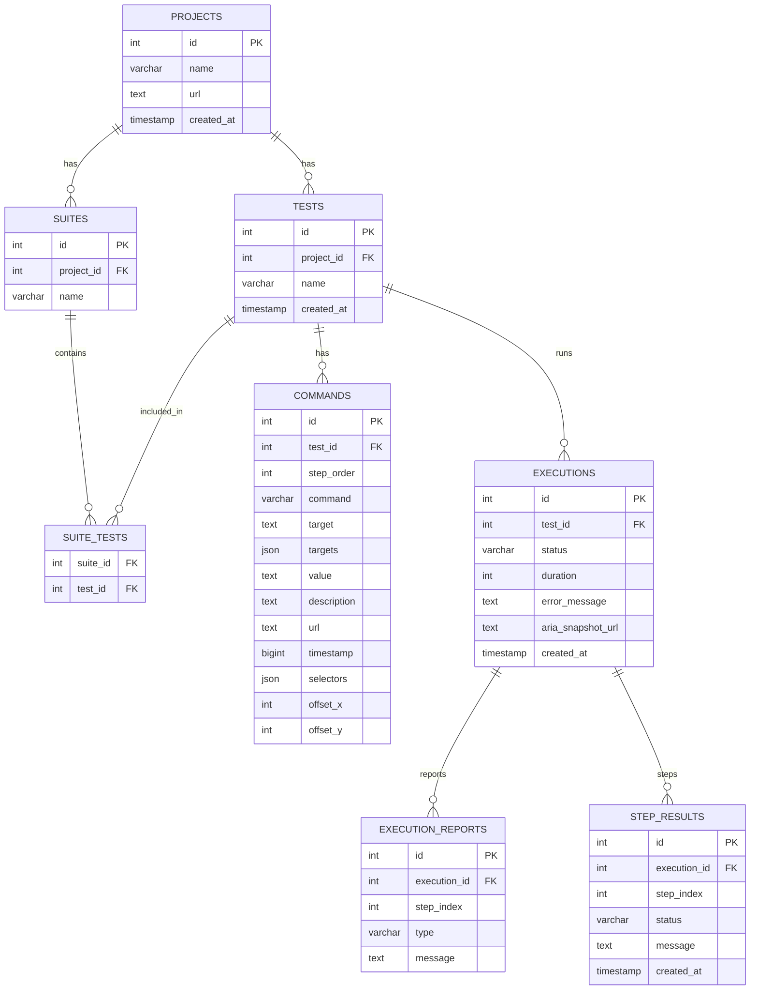

# Automation Agent - System Architecture Documentation

## Overview
This is a Chrome Extension-based web automation tool that records user interactions (clicks, inputs) on web pages and stores them as test cases in a MySQL database. The recorded flows can then be replayed automatically on web pages.

---

## System Components

### 1. **Chrome Extension (Frontend)**
**Location:** `extension-src/`

#### Components:

**a) Manifest (`manifest.json`)**
- Defines extension permissions and structure
- **Port Configuration:** None (extension doesn't use ports directly)
- **Key Permissions:**
  - `scripting` - To inject content scripts
  - `activeTab` - To access current tab
  - `storage` - To store flows locally in Chrome storage
  - `host_permissions: <all_urls>` - To work on any website

**b) Background Service Worker (`background.js`)**
- Runs in the background, manages recording state
- Coordinates communication between popup and content scripts
- **Port:** N/A (runs as Chrome extension service worker)
- **Responsibilities:**
  - Maintains recording state (isRecording flag)
  - Collects recorded steps from content script
  - Handles execution status updates

**c) Content Script (`content.js`)**
- Injected into web pages to record interactions
- Executes recorded steps during replay
- **Port:** N/A (runs in page context)
- **Responsibilities:**
  - Listens for clicks and input events (when recording)
  - Builds CSS selectors for elements
  - Executes steps during flow replay
  - Finds elements and performs actions (click, input)

**d) Popup UI (`popup.html` + `popup.js`)**
- User interface for controlling the extension
- **Port Configuration:** 
  - **API_BASE_URL:** `http://localhost:4000` (configured in `popup.js` line 3)
  - This is where the extension connects to the backend
- **Responsibilities:**
  - Start/stop recording
  - Load flows from backend
  - Display recorded steps
  - Trigger flow execution
  - Show execution logs

---

### 2. **Node.js Backend Server**
**Location:** `backend/`

#### Components:

**a) Express Server (`server.js`)**
- **Port Configuration:**
  - **Default Port:** `4000` (configured in `server.js` line 6)
  - Can be overridden with environment variable: `PORT`
  - Example: `PORT=7080 npm start` would run on port 7080
- **API Endpoints:**
  - `POST /api/test-cases` - Save a new test case with steps
  - `GET /api/test-cases` - List all test cases
  - `GET /api/test-cases/:id` - Get a specific test case with all steps

**b) MySQL Database Connection**
- **Configuration:** (in `server.js` lines 12-19)
  - **Host:** `localhost` (or `DB_HOST` env var)
  - **User:** `root` (or `DB_USER` env var)
  - **Password:** Empty by default (or `DB_PASSWORD` env var)
  - **Database:** `test_recorder` (or `DB_NAME` env var)
  - **Port:** MySQL default (3306)

**c) Database Schema**
ER diagram (current schema):


Table summary:
- **`projects`**: Top-level app/project container.
- **`tests`**: Recorded flows (belongs to a project).
- **`suites`** / **`suite_tests`**: Group tests into suites (many-to-many).
- **`commands`**: Individual recorded steps for a test (selectors + metadata).
- **`executions`**: Each run of a test (success/failed + timing).
- **`execution_reports`**: Bugs/nuances per execution + step.
- **`step_results`**: Per-step success/failure for an execution.

---

## Data Flow

### Recording Flow:
```
1. User clicks "● Record" in popup
   ↓
2. Popup → Background: START_RECORDING
   ↓
3. Background → Content Script: SET_RECORDING (enable)
   ↓
4. User interacts with webpage (clicks, types)
   ↓
5. Content Script captures event → Background: RECORD_STEP
   ↓
6. Background stores step in memory
   ↓
7. User clicks "■ Stop" in popup
   ↓
8. Background → Popup: Returns all recorded steps
   ↓
9. Popup → Backend API (POST /api/test-cases)
   ↓
10. Backend saves to MySQL database
    ↓
11. Backend responds with test case ID
    ↓
12. Popup displays success message
```

### Execution Flow:
```
1. User selects flow from dropdown in popup
   ↓
2. Popup → Backend API (GET /api/test-cases/:id)
   ↓
3. Backend queries MySQL and returns test case with steps
   ↓
4. Popup displays steps in table
   ↓
5. Popup → Content Script: EXECUTE_STEPS (with steps array)
   ↓
6. Content Script executes each step:
   - Finds element by CSS selector
   - Performs action (click or set input value)
   - Waits between steps
   ↓
7. Content Script → Background: FLOW_EXECUTION_COMPLETE
   ↓
8. Background → Popup: EXECUTION_STATUS_UPDATE
   ↓
9. Popup displays completion status
```

### Playback Status (Which Flow Runs / Fails First):
- **Popup UI (manual runs)**:
  - The popup sends `START_EXECUTION` and renders live logs.
  - Success/Failure is shown via `EXECUTION_STATUS_UPDATE`.
  - Primary files: `extension-src/popup.js`, `extension-src/background.js`, `extension-src/playback.js`.
- **E2E Runner (automated runs)**:
  - The runner prints which flow starts and records success/failure.
  - Failures are reported with the first stalled/failed step.
  - Primary file: `scripts/e2e/runner.js`.
- **Backend records**:
  - Each run is stored in `executions` with `status` and `error_message`.
  - Per-step results are stored in `step_results`.
  - Endpoints:
    - `GET /api/tests/:id/executions` (latest runs)
    - `GET /api/executions/:id/steps` (step-by-step success/failure)

---

## Port Configuration Summary

| Component | Port | Configuration Location | Notes |
|-----------|------|----------------------|-------|
| **Backend API** | `4000` (default) | `backend/server.js` line 6 | Can be changed via `PORT` env var |
| **MySQL** | `3306` (default) | MySQL server config | Standard MySQL port |
| **Chrome Extension** | N/A | `extension-src/popup.js` line 3 | Connects TO backend at `http://localhost:4000` |

**Important:** 
- The extension's `API_BASE_URL` in `popup.js` must match the backend port
- If backend runs on port 7080, update `popup.js` line 3: `const API_BASE_URL = "http://localhost:7080"`
- Backend port can be changed via environment variable: `PORT=7080 npm start`

---

## File Structure

```
extension/
├── extension-src/              # Chrome Extension
│   ├── manifest.json           # Extension configuration
│   ├── background.js           # Service worker (state management)
│   ├── content.js              # Page script (recording & execution)
│   ├── popup.html              # UI markup
│   └── popup.js                # UI logic (API calls to backend)
│
├── backend/                    # Node.js Backend
│   ├── server.js               # Express server + MySQL connection
│   ├── package.json            # Dependencies
│   └── node_modules/           # Installed packages
│
└── README.md                   # Setup instructions
```

---

## Key Technologies

- **Frontend:** Chrome Extension (Manifest V3), JavaScript
- **Backend:** Node.js, Express.js
- **Database:** MySQL
- **Communication:** 
  - Extension ↔ Backend: HTTP REST API (JSON)
  - Extension Components: Chrome Runtime Messages
  - Backend ↔ Database: MySQL2 (Promise-based)

---

## Setup & Configuration

### 1. Backend Setup:
```bash
cd backend
npm install                    # Install dependencies
export DB_HOST=localhost       # Optional: set MySQL host
export DB_USER=root            # Optional: set MySQL user
export DB_PASSWORD=            # Optional: set MySQL password
export DB_NAME=test_recorder   # Optional: set database name
export PORT=4000               # Optional: set server port
npm start                      # Start server
```

### 2. Database Setup:
```sql
CREATE DATABASE test_recorder;
-- Tables are auto-created by the backend on first run
```

### 3. Extension Setup:
1. Open Chrome → `chrome://extensions/`
2. Enable "Developer mode"
3. Click "Load unpacked"
4. Select the `extension-src` folder
5. Extension is ready to use

---

## Security Considerations

- Backend runs on `localhost` (not exposed to network)
- MySQL connection uses local credentials
- Extension requires explicit permissions for each website
- No sensitive data stored in Chrome storage (only flow metadata)

---

## Future Enhancements

- Add authentication for backend API
- Support for more action types (navigation, waits, assertions)
- Export/import flows as JSON
- Cloud database support
- Multi-user flow sharing
