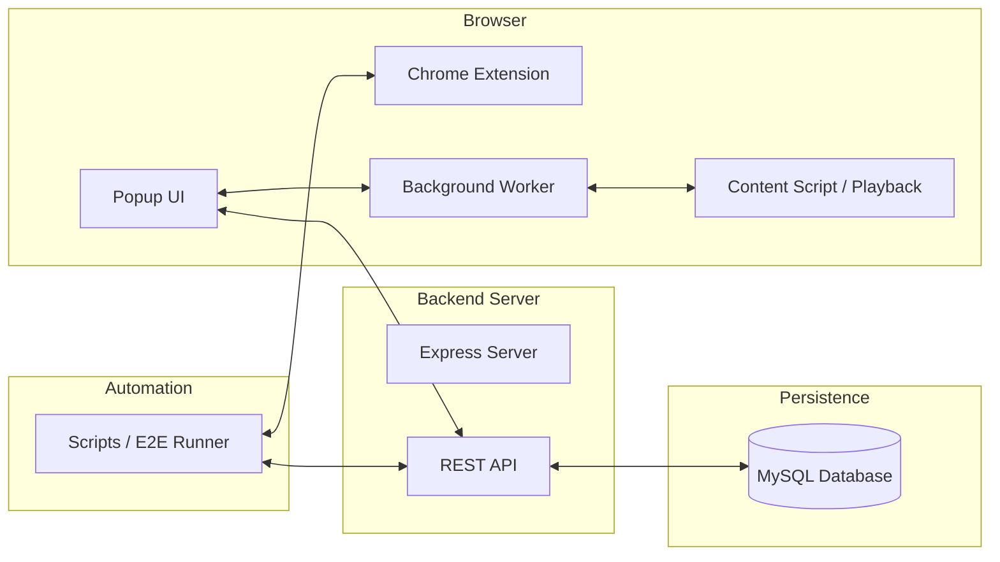

# Automation Agent Technical Overview

This document provides a detailed technical explanation of the Web Automation Extension and its Backend infrastructure. It covers architecture, data flows, API specifications, and core component logic.

---

## 1. System Architecture

The project follows a three-tier architecture:

1.  **Chrome Extension (Frontend/Client)**: Injected into the browser to record and replay user actions.
2.  **Node.js Backend**: An Express server that manages the lifecycle of test cases and execution reports.
3.  **MySQL Database**: Persistent storage for projects, tests, commands, and execution results.

### High-Level Architecture

---

## 2. API Reference

The backend operates on port `4000` by default.

### Projects & Tests

- `GET /api/projects`: List all automation projects.
- `GET /api/projects/:id/tests`: Get all recorded flows (tests) for a specific project.
- `POST /api/projects/:id/tests`: Create a new test case with a sequence of steps.
- `GET /api/tests/:id`: Retrieve a specific test case including its recorded selectors and metadata.
- `PUT /api/tests/:id`: Update test name or step sequence.

### Executions & Reports

- `POST /api/tests/:id/executions`: Save the result of a test run (success/fail, duration, step-by-step results).
- `GET /api/tests/:id/executions`: Get history of runs for a specific test.
- `GET /api/executions/:id/steps`: Get detailed success/failure status for every step in a specific run.

### Snapshots

- `POST /api/snapshots/upload`: Upload an ARIA or visual snapshot for a specific test step/failure.

---

## 3. Data Flows

### A. Recording a Flow

1.  **`recorder.js`**: Listens for global `click`, `input`, and `scroll` events.
2.  **`locator-builders.js`**: When an event occurs, it generates multiple selector strategies (ID, ARIA, CSS, XPath).
3.  **Cross-frame**: Message is sent from Content Script → `background.js` (Service Worker).
4.  **Buffer**: `background.js` holds steps in memory during the recording session.
5.  **Save**: On "Stop", `popup.js` fetches steps from `background.js` and `POST`s them to the Backend.

### B. Manual Playback (Popup)

1.  **Fetch**: `popup.js` calls `GET /api/tests/:id` to load steps.
2.  **Trigger**: `popup.js` sends `START_EXECUTION` to `background.js`.
3.  **Coordination**: `background.js` manages state (which step is current) and handles navigation.
4.  **Action**: `background.js` sends `EXECUTE_SINGLE_STEP` to the Content Script.
5.  **`playback.js`**: The Content Script locates the element using the prioritized selector strategy and performs the action.
6.  **Loop**: Once finished, Content Script sends `STEP_COMPLETE` back to `background.js`, which advances to the next step.

### C. Automated E2E Execution (`runner.js`)

1.  **Puppeteer**: The runner launches a browser instance with the extension loaded.
2.  **Fetch**: Runner fetches flows directly from the DB or API.
3.  **Direct Communication**: The runner can communicate with the Extension's Service Worker to trigger execution or monitor logs.

---

## 4. Prioritized Selector Strategy

The system uses a 12-tier strategy to find elements, ensuring stability even if the UI changes slightly:

1.  **Testing Attributes**: `data-testid`, `data-cy`, etc.
2.  **Stable ID**: Non-dynamic IDs.
3.  **Name Attribute**: Primarily for form inputs.
4.  **Placeholder**: For inputs/textareas.
5.  **ARIA Label**: Using accessible names (role + label).
6.  **XPath Text Match**: Precise text content match.
7.  **Alt/Title**: For images and specialized elements.
8.  **Href/Src**: Stable links or image sources.
9.  **Smart CSS**: Stable attributes combined with limited class names.
10. **Nth-of-type**: Positional mapping within a stable parent.
11. **Full CSS Path**: Deep selector hierarchy.
12. **Absolute XPath**: The "nuclear option" last resort.

---

## 5. Core Components Breakdown

| File                  | Responsibility                                                                    |
| --------------------- | --------------------------------------------------------------------------------- |
| `background.js`       | State management, cross-page coordination, and navigation handling.               |
| `playback.js`         | The execution engine. Handles element location, visibility checks, and retries.   |
| `recorder.js`         | Interaction listeners. Extracts metadata (offsets, descriptors) during recording. |
| `locator-builders.js` | The logic for converting a DOM element into a set of robust selectors.            |
| `overlay-utils.js`    | Detects and scopes element searches to modals, popovers, and drawers.             |
| `server.js`           | Express API implementation and database schema management.                        |
| `runner.js`           | Puppeteer-based script for running tests in a headless environment.               |

---

## 6. Advanced Logic

- **Shadow DOM Support**: `playback.js` includes a `deepQuerySelector` to penetrate shadow roots where normal `querySelector` fails.
- **Overlay Context**: If an element is within a modal, the recorder captures that context. During playback, the engine limits its search to that specific overlay to avoid duplicate matches.
- **Retry Mechanism**: Playback will retry finding an element for up to 30 seconds (configurable) to handle slow-loading pages or animations.
- **ARIA Snapshots**: On failure, the system captures an accessibility snapshot (JSON tree) to help debug why an element wasn't found.
